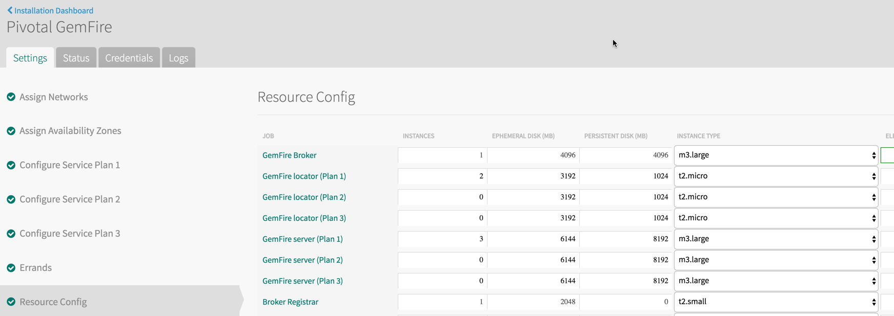

# Managing and Working With Gemfire On Pivotal Cloud Foundry

This sample shows how create and manage a Gemfire cluster as well as connect a running application to it. It will also shows how to troubleshoot the cluster.

## Why Pivotal Cloud Foundry and Gemfire?

Gemfire is a distributed system. Working with it comes the challenges of working with a distributed system:

1. Gemfire has tools to manage a members, less tools to manage the cluster
2. Obtaining artifacts from the members when trouble shooting can be challenging

The Gemfire tile sets up and configures the cluster with best practise configuration. Working with a Gemfire cluster running in PCF also makes obtaining artifacts from each member simple and easy.

## Obtaining The Gemfire Tile

The tile can be downloaded from the following URL:

https://network.pivotal.io/products/p-gemfire

## Adding The Tile

The tile can be uploaded in the Ops manager.

## Configuring The Tile

Each plan represents a cluster (Locators and Servers). Each plan can be configured as to what server resources are associated with each plan.

cf marketplace -s p-gemfire
