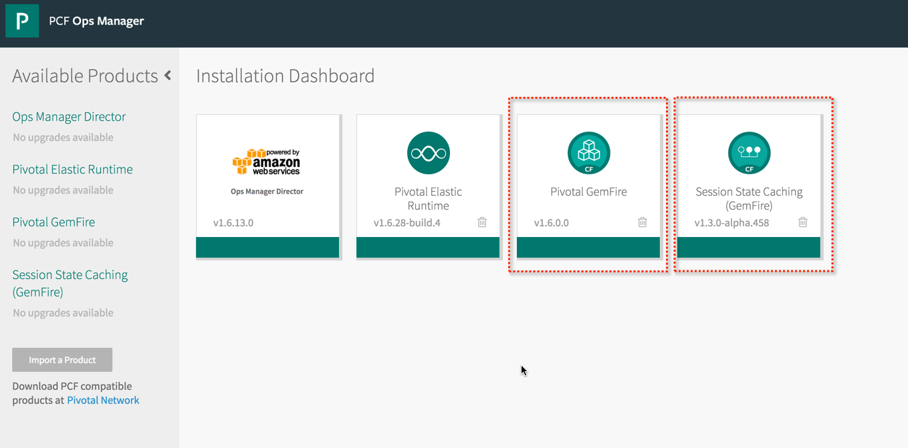
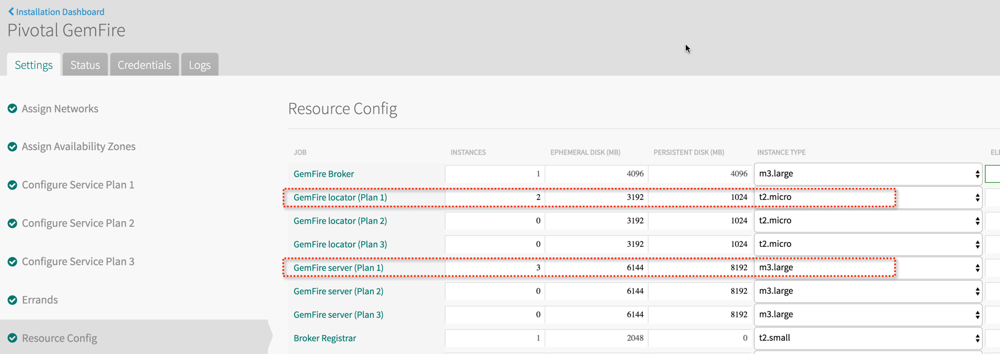

# Managing and Working With Gemfire On Pivotal Cloud Foundry

This sample shows how create and manage a Gemfire cluster as well as connect a running application to it. It will also shows how to troubleshoot the cluster.


## Why Pivotal Cloud Foundry and Gemfire?

Gemfire is a distributed system. Working with it comes the challenges of working with a distributed system:

1. Gemfire has tools to manage a members, less tools to manage the cluster
2. Obtaining artifacts from the members when trouble shooting can be challenging

The Gemfire tile sets up and configures the cluster with best practise configuration. Working with a Gemfire cluster running in PCF also makes obtaining artifacts from each member simple and easy.

## Obtaining The Gemfire Tile

The tile can be downloaded from the following URL:

https://network.pivotal.io/products/p-gemfire

## Adding The Tile

The tile can be uploaded in the Ops manager.



## Configuring The Tile

Each plan represents a cluster (Locators and Servers). Each plan can be configured as to what server resources are associated with each plan.



## Using The Tile

To make use of the tile the following needs to be installed:

### Cloud Foundry CLI

Cloud Foundry CLI for pushing and managing apps, creating and binding services, and more.

https://console.run.pivotal.io/2/tools

### The Gemfire CLI plugin

GemFire CLI is provided as a CF CLI plugin that includes commands for restarting, and configuring GemFire service instances, as well as downloading GemFire configuration and logs, on a per cluster basis.

http://docs.pivotal.io/gemfire-cf/gfe-cli.html

```shell

Downloads chmod a+x ./cf-gemfire-cli-darwin-amd64-1.6.0
Downloads cf install-plugin ./cf-gemfire-cli-darwin-amd64-1.6.0

**Attention: Plugins are binaries written by potentially untrusted authors. Install and use plugins at your own risk.**

Installing plugin ./cf-gemfire-cli-darwin-amd64-1.6.0...
OK
Plugin GemFire v1.7.0 successfully installed.

```
NOTE: To install a newer version, uninstall old version and install the new one

### Install Gemfire

This gets the Gemfire binaries set up and environmental variables in place to use gfsh. GemFire gfsh (pronounced "gee-fish") provides a single, powerful command-line interface from which you can launch, manage, and monitor GemFire processes, data, and applications.

http://gemfire.docs.pivotal.io/docs-gemfire/latest/getting_started/installation/install_standalone.html#concept_0129F6A1D0EB42C4A3D24861AF2C5425

On a MAC its easy with Brew:

```shell

$ brew tap pivotal/tap && brew install gemfire

```

With Gemfire installed and configured, gfsh can be access:

```shell

➜  actionable-spring-gemfire git:(master) ✗ gfsh
    _________________________     __
   / _____/ ______/ ______/ /____/ /
  / /  __/ /___  /_____  / _____  /
 / /__/ / ____/  _____/ / /    / /  
/______/_/      /______/_/    /_/    v8.2.1

Monitor and Manage GemFire
gfsh>

```

### Setting Up A Gemfire Cluster To Use

Find out the plans available:

```shell

cf marketplace -s p-gemfire

```

Configure the Cluster desired based on the plan:

```shell

cf create-service p-gemfire GemFireServicePlan1 customer-cache

```
### Viewing The Cluster With Pulse

Clicking on the 'Management' link in the console of Cloud Foundry brings up the Gemfire management console Pulse.


Pulse is a stand alone web application, which using JMX, provides a window into the health of the cluster.


### Connecting To The Cluster With gfsh

Get the gfsh connection string

```shell

➜  cache-create-config-example git:(master) cf show-gfsh customer-cache          
Use the following command in gfsh to connect to service instance customer-cache
    connect --use-http --url=https://gf-plan-1-dashboard-ca9cbf62-4407-4e63-5754-ed545ddbea0a.system.diamond.pcf-gemfire.com/gemfire/v1
For a non HTTPS connection (not recommended -- use with caution!) use the following command:
    connect --use-http --url=http://gf-plan-1-dashboard-ca9cbf62-4407-4e63-5754-ed545ddbea0a.system.diamond.pcf-gemfire.com/gemfire/v1

```
Connect to the cluster using the connection string

```shell
➜  cache-create-config-example git:(master) ✗ gfsh
    _________________________     __
   / _____/ ______/ ______/ /____/ /
  / /  __/ /___  /_____  / _____  /
 / /__/ / ____/  _____/ / /    / /  
/______/_/      /______/_/    /_/    v8.2.1

Monitor and Manage GemFire
gfsh>connect --use-http --url=http://gf-plan-1-dashboard-ca9cbf62-4407-4e63-5754-ed545ddbea0a.system.diamond.pcf-gemfire.com/gemfire/v1
Successfully connected to: GemFire Manager HTTP service @ http://gf-plan-1-dashboard-ca9cbf62-4407-4e63-5754-ed545ddbea0a.system.diamond.pcf-gemfire.com/gemfire/v1

gfsh>list members
Member Count : 5
Coordinator  : locator1 (10.0.16.67(locator1:5664:locator)<ec><v0>:40070)

    Name     | Id
------------ | -----------------------------------------------
cacheserver0 | 10.0.16.68(cacheserver0:5694)<v3>:10560
locator0     | 10.0.16.66(locator0:5800:locator)<ec><v1>:13163
cacheserver1 | 10.0.16.69(cacheserver1:5604)<v4>:23067
locator1     | 10.0.16.67(locator1:5664:locator)<ec><v0>:40070
cacheserver2 | 10.0.16.70(cacheserver2:5545)<v2>:53596

gfsh>

```
